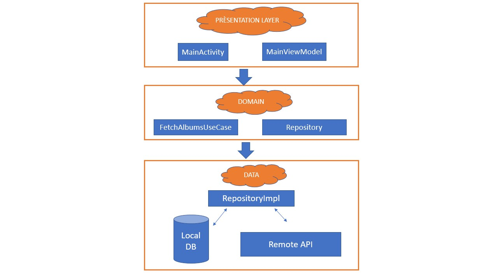

# LeBonCoin

Ce projet est réalisé dans le cadre du test technique pour LeBonCoin
J'ai essayer donc de me projeter comme un développeur travaillant en équipe sur un projet complexe et évolutif. D'où, mon choix d'utiliser la clean architecture modulaire. 
Le principe est de séparer les différentes couches du projets selon une responsabilité unique.
Ces différentes couches(layers), communiquent entre elles dans un sens bien définies qui respectent le principe de la clean architecture.

## Pourquoi la clean architecture?

Mon choix est dû à plusieurs raisons:

- Une parfaite séparation de responsabilité (Couches découplées)
- Le code est testable facilement
- La facilité et la rapidité d'ajouter des nouvelles features
- Le projet est encore plus facile à maintenir
- Pour un nouvel arrivant dans la team , l'apprentissage et la productivité est plus rapide
- Trés adaptée aux projets complexes

Une image vaut mille mots , voici ma solution en une image.

La couche PRÉSENTATION : contient les activity, adapters , viewmodels..
La couche DOMAIN : contient la définition abstraite du repository (sous forme d'interface) et la définition des usecases.
La couche DATA : contient l'implémentation des définitions abstraites du repository de la couche de DOMAIN (implémention de ses interfaces), la définition des sources de données (remote et locale), les mappers pour convertir des modéle d'API en entity pour la DB 
ou bien en domain modéle pour éviter les potentiels soucis liés au valeurs nullables.. 

PS: Pour une meilleur organisation du projet , j'ai mis les modules DOMAIN et DATA dans un submodule CORE.

Pour le choix des bilbliothéques , j'ai choisi de ne pas utiliser des libs tierces (pour le UI par exemple...) pour :
- Éviter les soucis liés à l'absence de maintenabilité de certaines libs aprés leurs intégration
- Éviter les soucis d'incompatibilité des versions entre les différentes bibliothèques.

## Les bibliothèques utilisées

### La persistance des données
ROOM : 
- Basée sur les annotation qui minimise le code
- Recommandée par Google
- Bien documentée et bien maintenue
- Facile à tester

### Les appels d'API

Retrofit2 : 
- Facile à utiliser et à comprendre
- Supporte différents types de converters (moshi, jackson, gson)
- Bien documentée et bien maintenue
- Trés performant

### Les tests 

MOCKK :
- Pour les projets en Kotlin, Mockk est plus adapté (Il est écrit en Kotlin aussi)
- Facile à apprendre et à appliquer

### L'injection de dépendance

Koin :
- Complètement écrit en Kotlin, donc c'est le mieux adapté
- Facile à comprendre et à intégrer , donc, ça permet de gagner du temps

### Le parsing

Moshi : 
- Léger (moins de code et de classes à embarquer dans l'APK)
- Adapté à la notion du nullable de Kotlin
- Adapté à Retrofit2

