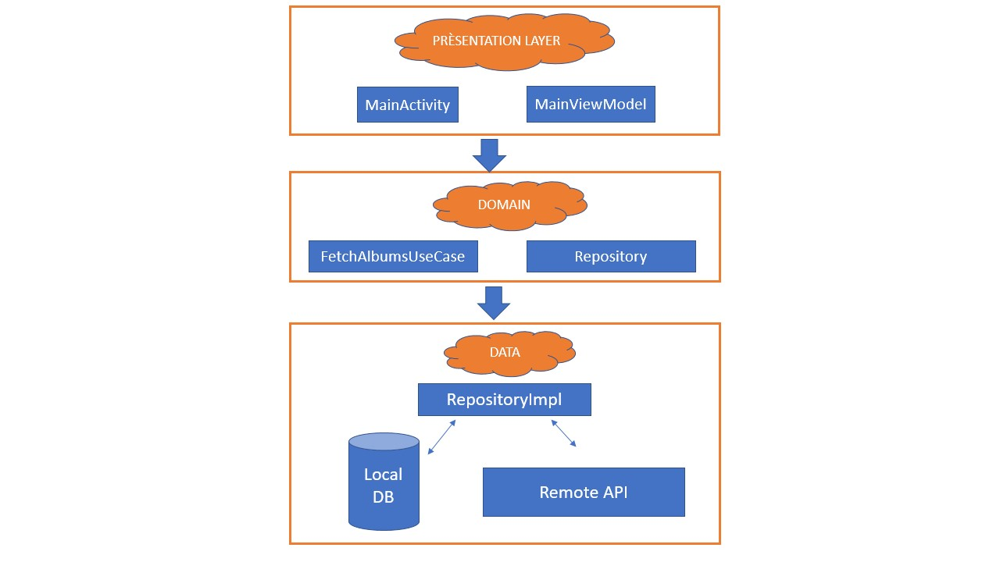

# LeBonCoin

Ce projet est réalisé dans le cadre du test technique pour LeBonCoin
J'ai essayer donc de me projeter comme un développeur travaillant en équipe sur un projet complexe et évolutif. D'où, mon choix d'utiliser la clean architecture modulaire. 
Le principe est de séparer les différentes couches du projets selon une responsabilité unique.
Ces différentes couches(layers), communiquent entre elles dans un sens bien définies qui respectent le principe de la clean architecture.

Une image vaut mille mots , voici ma solution en une image.

La couche PRÉSENTATION : contient les activity, adapters , viewmodels..
La couche DOMAIN : contient la définition abstraite du repository (sous forme d'interface) et la définition des usecases.
La couche DATA : contient l'implémentation des définitions abstraites du repository de la couche de DOMAIN (implémention de ses interfaces), la définition des sources de données (remote et locale), les mappers pour convertir des modéle d'API en entity pour la DB 
ou bien en domain modéle pour éviter les potentiels soucis liés au valeurs nullables.. 

PS: Pour une meilleur organisation du projet , j'ai mis les modules DOMAIN et DATA dans un submodule CORE.

